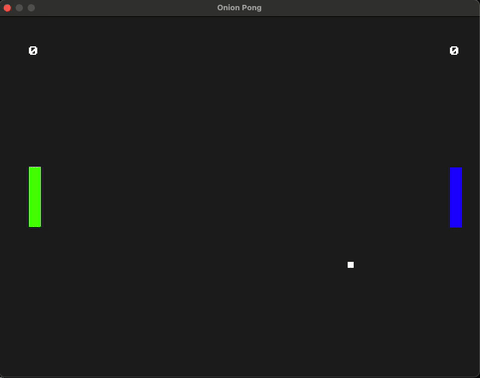
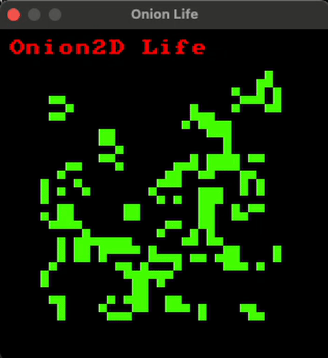
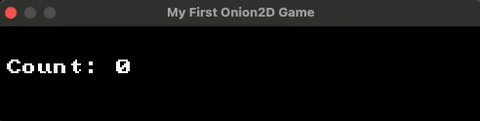

# LangJam GameJam!

Onion is a ***terrible*** LISP based programming language that smells bad and makes your eyes hurt, but its got layers!

## Table Of Contents

1. [Introduction](#introduction)
2. [Onion's Design](#onions-design)
    - [Design Goals](#design-goals)
    - [Peeling The Onion](#peeling-the-onion)
        - [A Familiar Example](#a-familiar-example)
        - [Alien Features](#alien-features)
            - [Operator Syntax](#operator-syntax)
            - [Blocks](#blocks)
            - [Tree Map & HashMap](#tree-map--hashmap)
            - [Modules](#modules)
            - [Pointers](#pointers)
            - [Structures](#structures)
    - [Drawbacks](#drawbacks)
    - [Benefits](#benefits)
3. [Onion2D](#onion2d)
    - [Inspiration](#inspiration)
    - [Demo](#demo)
    - [Introduction](#introduction-1)
4. [Hold The Line!](#hold-the-line)
5. [About the Author](#about-the-author)

## Introduction

I created Onion and Onion2D (its game engine) for the [LangJam GameJam](https://langjamgamejam.com/) in December 2025.
The programming language is inspired by LISP, but with a ton of syntactic sugar and special forms to make it easier to read and write.
The engine is inspired by the LÖVE framework for Lua, and provides a simple way to create 2D games with minimal boilerplate.

## Onion's Design

### Design Goals

The purpose of Onion's design was based on two pressures:

- I needed a language easy enough to implement in a short amount of time for a game jam.
- I needed it to support rich features to enable game development.

Now, despite my love for LISP and its excellent & elegant design, I find it **incredibly** difficult to read due to the syntax.
Prefix syntax does not come naturally to me, and the turbo-nested layers of parens make it impossible to tell what code section
I'm looking at sometimes.

I wanted to keep the core beauty of LISP, which makes it so easy to implement, while also putting bandaids on the drawbacks.
As a result, I struck a balance where, the semantics of the Onion language are just LISP's: the **core interpreter is just running a pure Scheme-like LISP**.
Instead of modifying the interpreter, I added loads of special forms and parser features to enable all the crazy features!

### Peeling The Onion

#### A Familiar Example

First, let's take a look at some pure Scheme-like code, and how we might modify it to be easier to read.

```lisp
(defun fib (n)
    (if (<= n 1)
        n
        (+ (fib (- n 1)) (fib (- n 2)))))
```


This code, specifically to non-LISPers such as myself, is pretty difficult to read; the same code in Python or C is 
significantly more readable.

Let's see if we can make it easier by introducing some Onionisms.

```lisp
(defun fib (n) 
    (if n <= 1
        n
        (fib n - 1) + (fib n - 2)))
```

Wow, that shaved off some parentheses and made it easier to read the math! Additionally, both of these forms are valid Onion code, so write it however you'd prefer.

#### Alien Features

##### Operator Syntax

Onion, as you may have noticed, supports infix operator syntax for common mathematical and logical operations.
This means you can write expressions like:

```lisp
x = 10 + 5 * 2
y = x >= 20 and x < 50
```

Here's a table of ***some*** of the more salient ones, although we'll cover `.` later:
|Operator|Description|
|-|-|
|`!`|Take a number and negate its sign.|
|`?`|Access a list element from the first argument, using the second argument as a key.|
|`and`|Perform logical `and` on all the arguments.|
|`or`|Perform logical `or` on all the arguments.|
|`not`|Perform logical not on the argument.|
|`+`|Addition of numbers, concatenation of lists, strings, maps.|  
|`-`|Subtract the second argument from the first.|
|`*`|Multiply the first argument by the second.|
|`/`|Divide the first argument by the second.|
|`%`|Take the remainder of the first argument by the second.|
|`==`|Compare two values for equality.|
|`!=`|Compare two values for inequality.|
|`>=`|Compare two values by order, check if the first argument is greater than or equal to the second.|
|`<=`|Compare two values by order, check if the first argument is less than or equal to the second.|
|`>`|Compare two values by order, check if the first argument is greater than the second.|
|`<`|Compare two values by order, check if the first argument is less than the second.|
|...|...|

##### Blocks

Onion performs chained operations with `do` blocks, which are simply a series of expressions that return the last expression's value.

```lisp
result = (do
    (println "Calculating...")
    x = 10 + 5 * 2
    y = x >= 20 and x < 50
    (if y
        "x is between 20 and 50"
        "x is not between 20 and 50"
    )
)
(println result)
```

The `do` block doesn't have any cool monadic properties or anything fancy like that, but it's useful for creating a short block that can do more than one thing while still returning a single value.

Onion's shorthand for this is the curly brace syntax: all `do` blocks can be replaced with curly braces.

```lisp
result = {
    (println "Calculating...")
    x = 10 + 5 * 2
    y = x >= 20 and x < 50
    (if y
        "x is between 20 and 50"
        "x is not between 20 and 50"
    )
}
(println result)
```

##### Tree Map & HashMap

Collections like maps are essential for developers to use conveniently.

To declare an ordered map in Onion, you simply use the square brackets `[]` with key value pairs:

```lisp
map = [x 10 y 10]
(println map ? 'x) ;; The `?` function accesses lists and maps with a key
```

You can also declare a hashmap instead by adding a hashtag!

```lisp
map = #[x 10 y 10]
(println map ? 'x)
```

##### Modules

The map types above are used heavily in the standard library: the standard library itself is implemented as several hashmaps of functions (stored as references, of course).

```
(println OS)
(println IO)
(println String)
(println Collections)
(println Math)
(println Reflect)
(println Time)
(println Game)
```

|Module|Description|
|-|-|
|`OS`|Functions for interacting with the operating system, mostly environment variables and `exit`ing.|
|`IO`|Functions for reading and writing files.|
|`String`|Functions for manipulating strings, like formatting and splitting.|
|`Collections`|Functions for manipulating and accessing maps, strings, and lists.|
|`Math`|Mathematical functions like `sin`, `cos`, `sqrt`, and random number generation.|
|`Reflect`|Functions for inspecting types and values at runtime.|
|`Time`|Functions for measuring time and sleeping.|
|`Game`|Functions for interacting with the Onion2D game engine! Drawing to the screen, handling input, and playing sounds.|

##### Pointers

Now, I said earlier the core semantics of Onion were pure Scheme-like LISP. There's one exception, but it doesn't change the actual `eval` code implementation: ***references***.

References are an Atom value that contain a shared pointer to another expression.
Unfortunately, Onion reserves its god given right to mutate these references as it damn well pleases.

All of the code that manipulates references, though, is done independent of the `eval` implementation!
Each of these operators you're about to see are all ***special, builtin functions***!

```lisp
;; `new` is a function that takes a value, and returns
;; a shared pointer constructed with it!
p1 = new #[x 10 y 10]

;; `.` here is also a function: it fetches the member with the associated symbol.
;; If the member itself is also a function, some tricky stuff happens!
;; We'll see later!
(println p1.x)

;; `=` checks if the left is a member access first, and modifies the referred
;; value if so. Otherwise it declares a new variable!
p1.x = 5

;; This will print `#[x 5 y 10]`
(println p1)
```

##### Structures

Now that we have smart builtin functions like `.` and `=` that can support the kind of black magic that typical programmers are used to, the standard library has some helpers to get us a little bit further!

```lisp
(struct Point (x y)
    ;; Get the distance between two points
    (distance (other)
        (sqrt (self.x - other.x) * (self.x - other.x)
            + (self.y - other.y) * (self.y - other.y))
    )

    ;; Shift this point over by a dx and dy
    (shift (dx dy) {
        self.x = self.x + dx
        self.y = self.y + dy
    })

    ;; Return a string formatted with the point data
    (show ()
        (String.fmt "({}, {})" self.x self.y)
    )
)

p1 = (Point 5 0)
(p1.shift !5 0)
(println (p1.show)) ;; Will print `(0, 0)`

p2 = (Point 1 1)
(println (p1.distance p2)) ;; Will print the square root of 2
```

The `struct` builtin is simply a function that creates a constructor with the struct name: the constructor creates a `new` reference, populates it with the members, and returns it.

Whenever `.` is accessed and a function is returned, the `.` operator adds the parent reference (`self`) to the environment for the method: the method's environment acts like `self` is a captured variable in a normal closure.

### Drawbacks

Onion's design was very shortsighted given the time constraints. I failed to implement an error type beyond `nil` early on, and so I had all my standard library functions return a `nil` failure result by default if there was a type mismatch or invalid arguments.

Dear god that was the biggest I could've made.

I spent *hours* trying to track down bugs that should've been much easier to fix, and truthfully it would've been faster to go back and reimplement the standard library functions sooner to panic. I didn't prioritize this until the 17th, and my development speed EXPLODED when I was finally able to track down errors, instead of having `nil` propagate into ***every nook and cranny of the code***.

Additionally, because Onion doesn't need parentheses for lots of expressions, it made it exponentially worse and really unintuitive to identify these bugs. ***Many*** times, I accidentally left out the parentheses in comparison expressions for method calls `tile.get_total_power > 0` instead of `(tile.get_total_power) > 0`, and everything would turn to `nil` for seemingly no reason.

Before I added panicking to all the standard library calls on errors, it was unendingly frustrating to try and debug ANYTHING more complicated than a few dozen lines.

### Benefits

Despite those damning drawbacks, there are a lot of benefits to Onion! Once I *did* finally add those panics, Onion became really nice to write in! It's like a choose-your-own-adventure Python: it's incredibly easy to add new functionality to the core language however you'd like!

I'm very proud of the ease of implementing Onion: the core language is only defined in less than 1000 lines (`src/expr.rs`, `src/context.rs`, although this doesn't count the parser)! Additionally, all the cool developer features are things that could be imported or provided by external libraries in a "real" implementation. I'm very glad that holding steadfast to the LISP core paid dividends: the only other core language that could support this kind of quick development would have to be a FORTH, which I'm very unfamiliar with at the moment.

## Onion2D

### Inspiration

Onion2D is certainly the most developed component of the language. It's heavily inspired by the LÖVE framework for Lua (although I've never used that engine). I saw that it was used for Balatro, gave the wiki a look, and thought it was really neat!

I was particularly impressed with the [Callbacks](https://love2d.org/wiki/Tutorial:Callback_Functions) section of the wiki: it looks so simple!

Onion2D's design tries to mirror this closely: I wanted the core functionality to be in just a handful of callbacks, with simple drawing and IO functions.

### Demo

I first started with a couple of examples: Pong and Game of Life. These helped me lay out the core functions of the engine and build a tiny framework for setting up games in a convenient, mostly procedural way.



Pong is incredibly easy to write, [it fits in ~60 lines of code](examples/pong.onion)!

Game of Life is a bit more dynamic, and I used LISP's traditional purely functional approach when handling grid updates. The approach I took was ~100 lines, but I'm certain it could be done significantly better, especially if structs and references were used to represent each tile and for counting neighbors. That way, you wouldn't be copying the list and constructing a new one each iteration like I did with `map`.




### Introduction

The core of the game engine is governed by three functions:

|Function|Purpose|
|-|-|
|`load ()`|Load initializes the game state and any media assets (sound, images, etc.)|
|`update (dt)`|Takes the change in time and updates the game state accordingly. Here the developer tracks user input and handles game logic.|
|`draw ()`|Draw the current game state to the screen. It uses simple engine functions like `draw_image`, `draw_text`, and `rect` to render game elements and the engine will handle presenting it to the screen.|

When `Game.run` is called with some window parameters, the engine initializes the window, runs `load`, and sets up a game loop that repeatedly calls `update` and `draw` as fast as possible. These three functions are all that are required to make a game in Onion2D! `Game.run` will look them up in the current scope and call them automatically, so you just have to define them!

```lisp
state = new [
    count 0
]

(defun load () {})

(defun update (dt) {
    (if (Game.is_key_down "UP") 
        state.count = state.count + 1
    )

    (if (Game.is_key_down "DOWN")
        state.count = state.count - 1
    )
})

(defun draw () {
    (Game.clear 0x000000)
    (Game.draw_text 10 200 (String.fmt "Count: {}" state.count) 0xFFFFFF 2)
})

(Game.run "My First Onion2D Game" 500 100)
```

This simple example just functions as a counter while holding down the UP/DOWN arrows! Pretty neat right?



## Hold The Line!

Now, for the moment you've all been waiting for: the game I made for the LangJam GameJam using Onion2D!


It's based on the UFO50 game [Avianos](https://ufo50.miraheze.org/wiki/Avianos), which is a 2D army management/strategy game where you
raise units, construct buildings, and harvest resources to beat your opponent. I've spent countless hours on it, which lead me to make this.

> [!NOTE]
> Originally, I set out to create a factorio-like game using a cellular automaton. This was way too big in scope, and I got really frustrated trying to come up with all the rules and recipes in my buggy programming language. I threw it out and started on this instead!

The motivation for this was that the game only had one major mechanic: the battle visualization. This acts as a random coinflip for casualties and wins/losses, while also providing a really sick graphical representation of the units going to war.

Once I had that mechanic implemented, I essentially just needed to graft a fancy menu on top of it! That's pretty much how the game functions: it's a constrained menu that lets the player deploy units and start the battle function!

I'm really pleased with this game design: I feel like it mirrors the engine in that it's very quick and dirty to implement, while still maintaining lots of beauty.
Each unit type has a different kind of formation with varying sizes, and each unit type coheres, separates, and aligns differently. The simulation is performed with [Boids](https://en.wikipedia.org/wiki/Boids): each squadron has an enemy target, and each of the units within the squadron attempt to destroy the target. Each unit type forms a different formation with unique formation sizes: infantry has the largest squadron size of 8, shrinking down to 3 with artillery.

## About the Author

[I'm Adam McDaniel](https://adam-mcdaniel.github.io/), a software engineer and computer science PhD student at the University of Tennessee Knoxville. I'm passionate about programming languages, compilers, and formal methods. I'm a huge fan of Rust and functional programming, and I love building tools that help people write better software.

Here's some interesting links for some of my other projects:

### My Interesting Links

|Website|
|---|
|[My main programming language🧑‍💻](https://adam-mcdaniel.net/sage-website)|
|[My shell🐚](https://adam-mcdaniel.net/dune-website/)|
|[My blog📝](https://adam-mcdaniel.net/blog)|
|[My YouTube📽️ (compilers and music)](https://youtu.be/QdnxjYj1pS0?si=pwvegcPkEvqmqF8b)|
